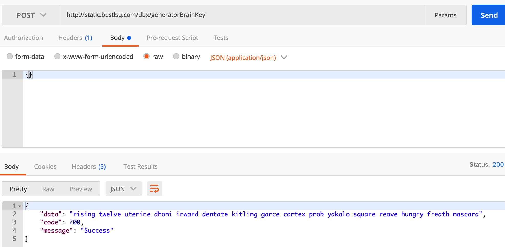

# dbx-chain-server
> dbx 工具服务(nodejs)

## 运行环境

  - [nodejs](https://nodejs.org)

    + npm (nodejs内置)
    
  - [yarn](https://yarnpkg.com)
  - [pm2](https://www.npmjs.com/package/pm2)

> `npm`和`yarn`选其一即可，推荐使用`yarn`

## 部署方法

### yarn安装 (推荐)
```bash
# 安装依赖
yarn

# 安装pm2
yarn global add pm2
```
### npm安装
```bash
# 安装依赖
npm install

# 安装pm2
npm install -g pm2
```

### 启动服务(`yarn`|`npm`)
```bash
# 默认端口3000
yarn run prd

# 指定端口(Mac|Linux)
PORT=10080 yarn run prd

# 指定端口(Windows)
set PORT=10080
yarn run prd
```

## URL规则说明

POST: `http://ip:port/{method}`

`{method}`: [dbx-chain-tools](https://www.npmjs.com/package/dbx-chain-tools) 工具的方法，参数在请求body中携带

## 调用

```js
$.ajax({
	url: 'http://localhost:3000/encodeMemo',
	type: 'POST',
	dataType: 'json',
	contentType: 'application/json',
	data: { pKey, fromKey, toKey, memo },
	success: (res) {
		// 成功
		if (res.code === 200) {
			console.log(res.data)
		} else {
			// 失败
			console.error(res.message)
		}
	}
})
```

## 示例

  - 生成助记词：

    
